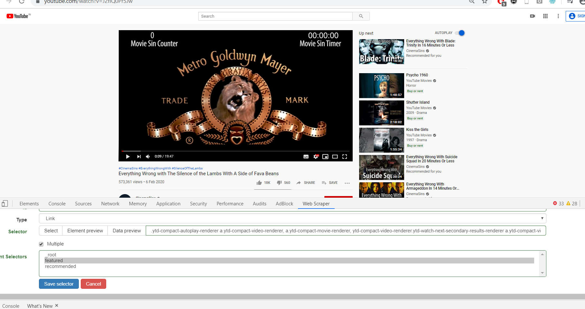

# Computational Social Science Methods

[Course Link](https://www.coursera.org/learn/computational-social-science-methods?specialization=computational-social-science-ucdavis)

This course gives you an overview of the current opportunities and the omnipresent reach of computational social science. The results are all around us, every day, reaching from the services provided by the world’s most valuable companies, over the hidden influence of governmental agencies, to the power of social and political movements. All of them study human behavior in order to shape it. In short, all of them do social science by computational means.

In this course we answer three questions:
1. Why Computational Social Science (CSS) now?
2. What does CSS cover?
3. What are examples of CSS?

In this last part, we take a bird’s-eye view on four main applications of CSS. First, Prof. Blumenstock from UC Berkeley discusses how we can gain insights by studying the massive digital footprint left behind today’s social interactions, especially to foster international development. Second, Prof. Shelton from UC Riverside introduces us to the world of machine learning, including the basic concepts behind this current driver of much of today's computational landscape. Prof. Fowler, from UC San Diego introduces us to the power of social networks, and finally, Prof. Smaldino, from UC Merced, explains how computer simulation help us to untangle some of the mysteries of social emergence.

This course if offered by UC Davis

## Peer Review Assignment : Web Scraping YouTube Videos

T​his activity is meant to us with practice for configuring an out-of-the-box machinery tool to create a database that we can use for analysis. We will need this skill to progress further in this Specialization.

We will scrape data from 2 YouTube channels : CinemaSins and Collider Videos, using [Webscraper.io](https://webscraper.io/) ,
that takes advantage of the Chrome browser from Google.

### Building the Scraper - Create sitemap

### Building the Scraper - Create list of Videos

### Scrape!

### Export Data

