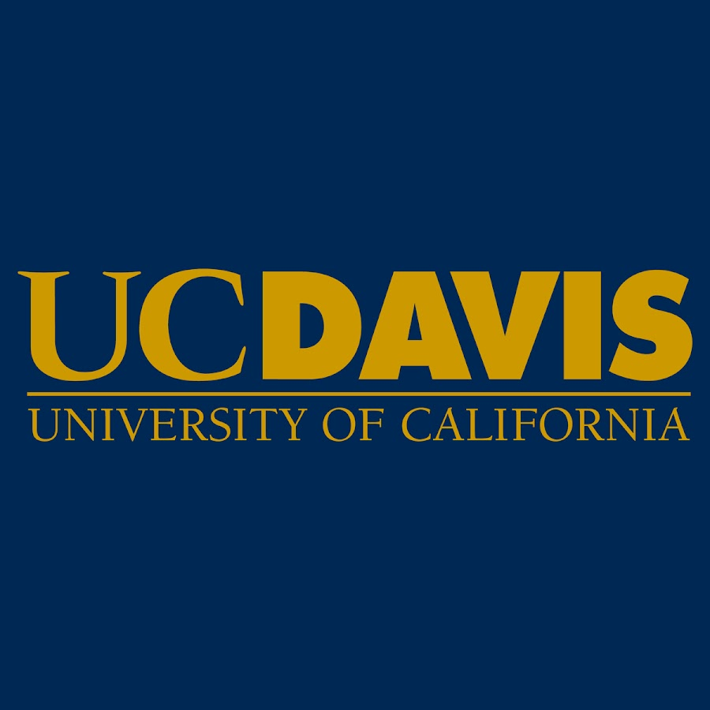
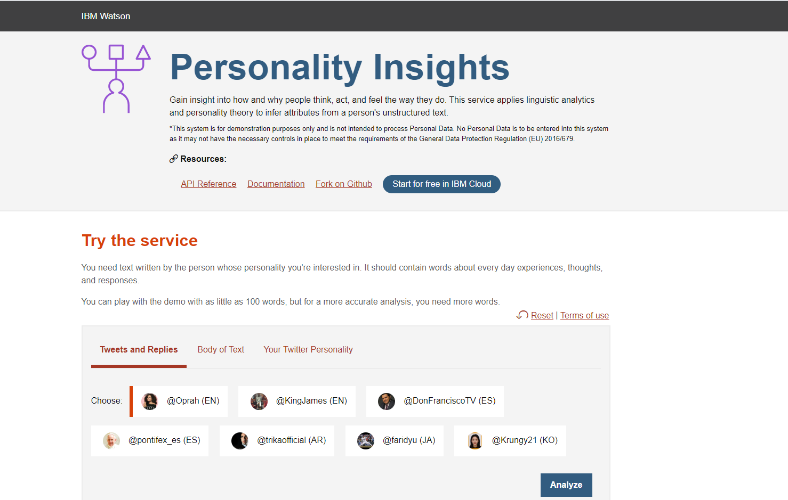
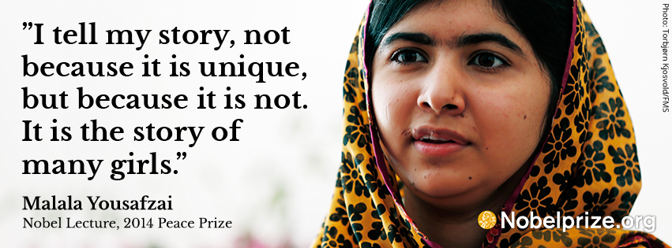
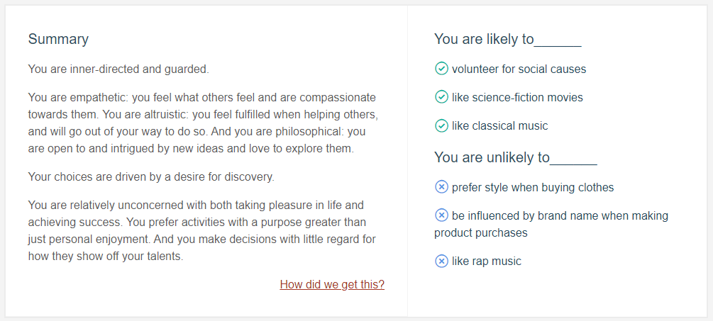
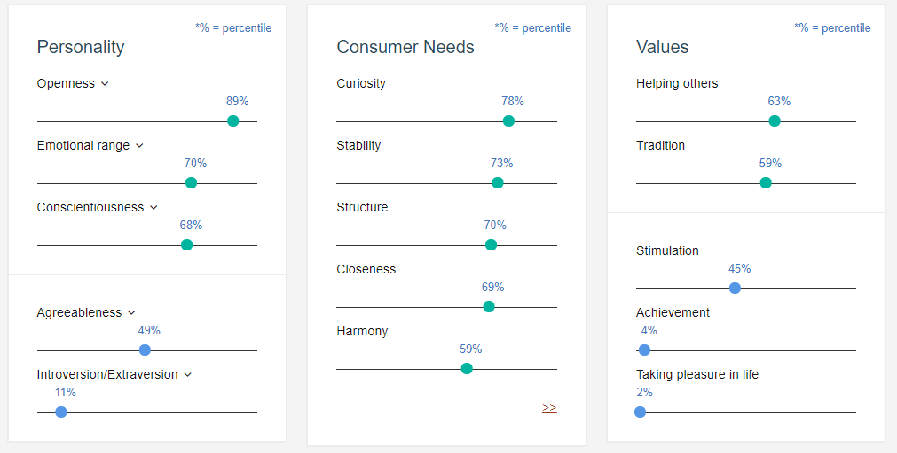
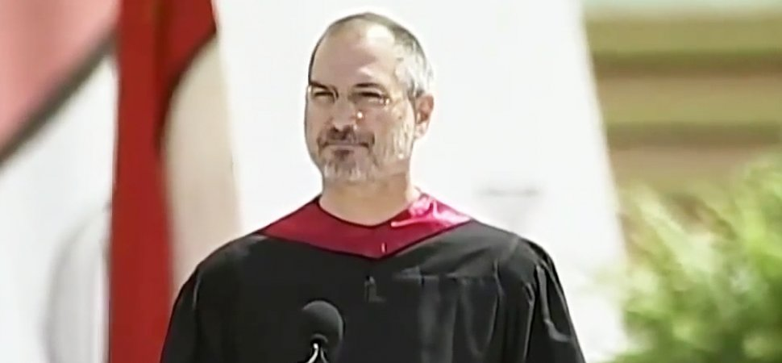
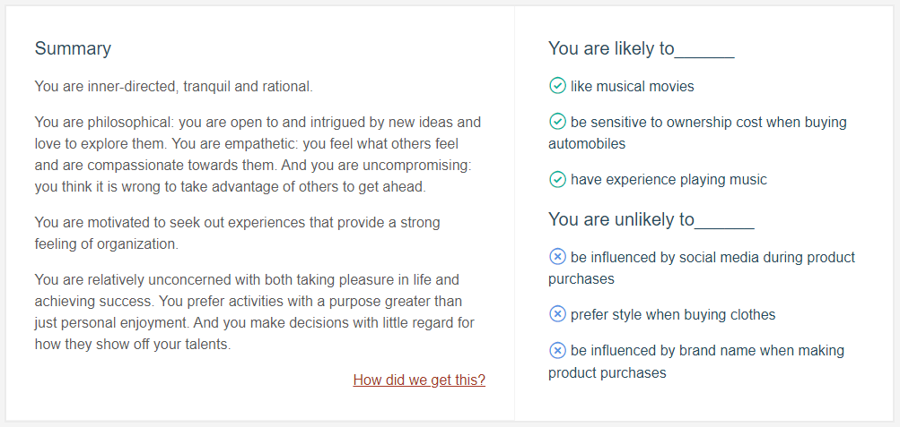
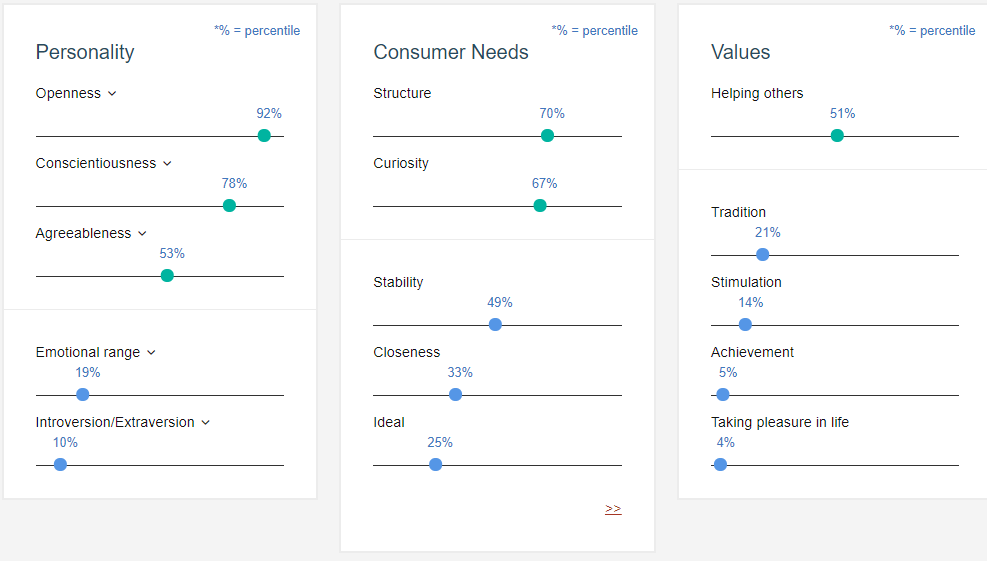

# Big Data, Artificial Intelligence, and Ethics

[Course Link](https://www.coursera.org/learn/big-data-ai-ethics)

This course gives you context and first-hand experience with the two major catalyzers of the computational science revolution: big data and artificial intelligence. With more than 99% of all mediated information in digital format and with 98% of the world population using digital technology, humanity produces an impressive digital footprint. In theory, this provides unprecedented opportunities to understand and shape society. In practice, the only way this information deluge can be processed is through using the same digital technologies that produced it. Data is the fuel, but machine learning it the motor to extract remarkable new knowledge from vasts amounts of data. Since an important part of this data is about ourselves, using algorithms in order to learn more about ourselves naturally leads to ethical questions. Therefore, we cannot finish this course without also talking about research ethics and about some of the old and new lines computational social scientists have to keep in mind. As hands-on labs, you will use IBM Watson’s artificial intelligence to extract the personality of people from their digital text traces, and you will experience the power and limitations of machine learning by teaching two teachable machines from Google yourself.

This course if offered by UC Davis

## Peer-graded Assignment: Natural Language Processing (NLP)

### Speech Analysis using NLP : Malala Yousafzai & Steve Jobs

For this assignment, you will gain insight on two ‘personalities’ by doing Natural Language Processing on a sample speech from each personality.

1. Malala Yousafzai : Pakistani activist for female education and the youngest Nobel Prize laureate (age 17). She is known for human rights advocacy, especially the education of women and children.
[Malala Yousafzai Nobel Lecture](https://www.nobelprize.org/prizes/peace/2014/yousafzai/26074-malala-yousafzai-nobel-lecture-2014/)

2. Steve Jobs : an American entrepreneur, business magnate, inventor, and industrial designer. He was the chairman, chief executive officer (CEO), and a co-founder of Apple Inc.
[Steve Job's commencement address at Stanford](https://news.stanford.edu/2005/06/14/jobs-061505/)

### We will analyze the speeches using Personality Insights

[Personality Insights](https://personality-insights-demo.ng.bluemix.net/) is a service that applies linguistic analytics and personality theory to infer attributes from a person's unstructured text.
It is powered by IBM Watson.

### Results

### Malala Yousafzai

### Steve Jobs

