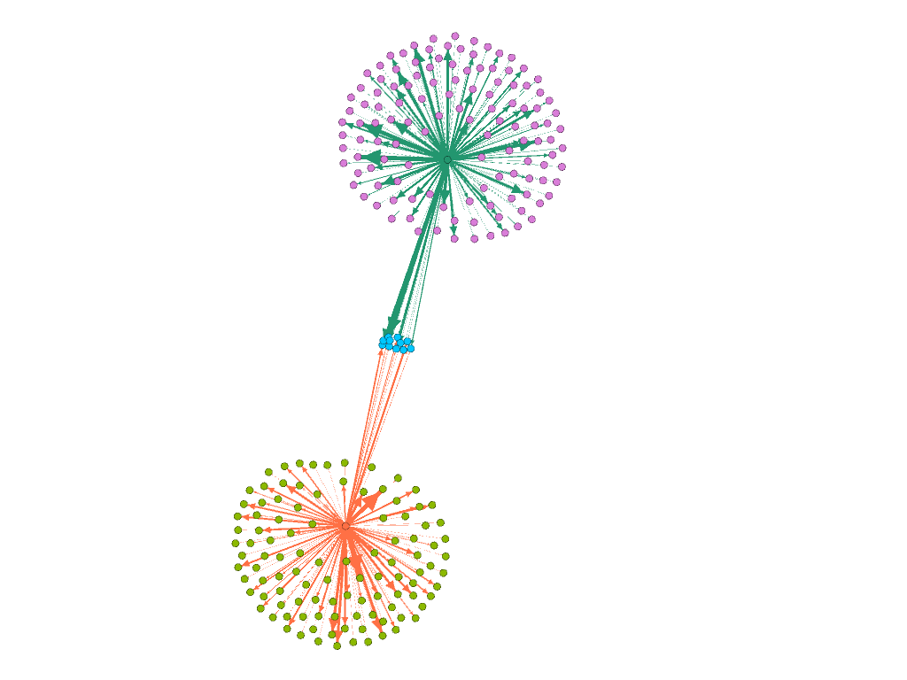

# Social Network Analysis

[Course Link](https://www.coursera.org/learn/social-network-analysis/home/info)

This course is designed to quite literally ‘make a science’ out of something at the heart of society: social networks. Humans are natural network scientists, as we compute new network configurations all the time, almost unaware, when thinking about friends and family (which are particular forms of social networks), about colleagues and organizational relations (other, overlapping network structures), and about how to navigate delicate or opportunistic network configurations to save guard or advance in our social standing (with society being one big social network itself). While such network structures always existed, computational social science has helped to reveal and to study them more systematically. In the first part of the course we focus on network structure. This looks as static snapshots of networks, which can be intricate and reveal important aspects of social systems. In our hands-on lab, you will also visualize and analyze a network with a software yourself, which will help to appreciate the complexity social networks can take on. During the second part of the course, we will look at how networks evolve in time. We ask how we can predict what kind of network will form and if and how we could influence network dynamics.

This course if offered by UC Davis

## Peer-graded Assignment: Social Network Analysis Lab
### SNA of 2 YouTube Channels : CinemaSins and ColliderVideos.

Analysis of a social network with the help of the Software [Gephi](https://gephi.org/) : a visualization
and exploration software for graphs and networks.
We use the databases we created in our [Web Scraping Assignment](https://github.com/athos2113/Computational-Social-Science-Specialization/tree/master/1.%20Computational%20Social%20Science%20Methods)

> We will scrape data from 2 YouTube channels : CinemaSins and Collider Videos, using Webscraper.io , that takes advantage of the Chrome browser from Google.

### Upload the Database that contains data of both the YouTube channels

### Implement Yifan Hu algorithm to the Graph

[Yifan Hu](https://gephi.org/tutorials/gephi-tutorial-layouts.pdf) is a very fast algorithm with a good quality on large graphs. It combines a force-directed model with a graph coarsening technique (multilevel algorithm) to reduce the complexity. The repulsive forces on one node from a cluster of distant nodes are approximated by a Barnes-Hut calculation, which treats them as one super-node. It stops automatically.

#### Yifun Hu algorithm
#### Kind : Force-directed + multilevel
#### Complexity : O(N*log(N))

### Analysis of the Network : Average Degree

The average degree of an undirected graph is used to measure the number of edges compared to the number of nodes. To do this we simply divide the summation of all nodes' degree by the total number of nodes.

The average degree of our graph is 1.037

### Analysis of the Network : In-Degree
In-Degree tells us how many links are directed towards a node.

For In-Degree We get 3 Categories:

The First Category (Node with 1 In-Degree) constitutes the biggest proportion of the graph. These are the nodes of the 2 distinct clusters. There receive an edge from the single, influential node.

The Second Category (Node with 2 In-Degree) are the gatekeepers, the intermediaries. They receive the edges from the influential node of the 2 clusters.

The Third Category (Node with 0 In-Degree) are the influential node themselves. They constitute the smallest proportion of nodes in the graph. They don't receive any edge from a node.

### Analysis of the Network : Out-Degree
Out-Degree tells us how many links are projected from a node.

For Out-Degree We get 3 Categories:

Out-Degree : The First Category (Nodes with 0 Out-Degree) represent the biggest proportion of the graph. These are the nodes of the 2 distinct clusters. There receive an edge from the single, influential node & don't project an edge themselves.

The Second & Third Category (Nodes with 117 & 135 Out-Degree) represent the 2 influential nodes of the 2 distinct clusters. They have 0 In-Degree and the maximum out-degree.

### Analysis of the Network : Shared Nodes

11 Nodes (videos) are shared by both YouTube channels.

### Analysis of the Network : Closeness Centrality
In a connected graph, closeness centrality (or closeness) of a node is a measure of centrality in a network, calculated as the reciprocal of the sum of the length of the shortest paths between the node and all other nodes in the graph. Thus, the more central a node is, the closer it is to all other nodes.

Our Graph has a **radius of 2 and Diameter of 4**.

We get 5 groups of nodes with varying Closeness Centrality (CC):

The Two central nodes of the two YouTube channel clusters (Dark Green & Orange Node) have the highest CC (0.531 & 0.502).
That makes sense since these 2 nodes have the shortest paths between all the other nodes.

The nodes of the two clusters (Pink & Light Green nodes) constitute the 3rd and 4th clusters of CC

Finally, the gatekeepers, the intermediaries (Blue Nodes) constitute the 5th cluster of CC

### Analysis of the Network : PageRank
PageRank works by counting the number of links to a node to determine a rough estimate of how important that node is. The underlying assumption is that the more important nodes are more likely to receive links from other nodes.

We get 4 groups of nodes for the PageRank.

PageRank is useful in sorting the nodes according to their usefulness. The higher the PageRank, the more links it has to other nodes.
