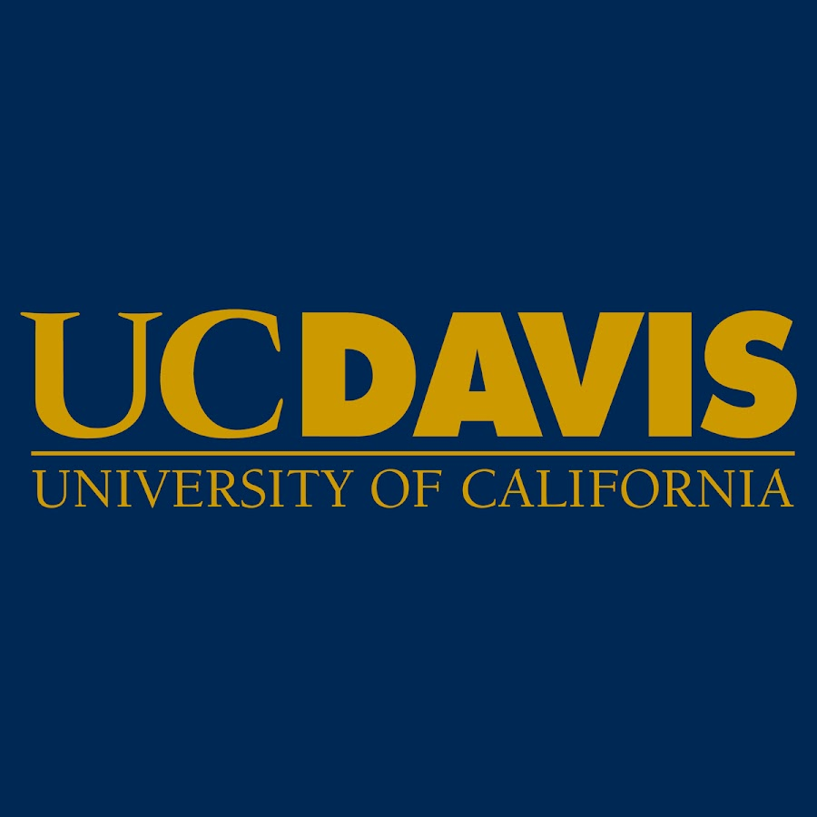
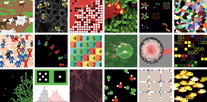

# Computer Simulations

[Course Link](https://www.coursera.org/learn/computer-simulations/home/info)

Big data and artificial intelligence get most of the press about computational social science, but maybe the most complex aspect of it refers to using computational tools to explore and develop social science theory. This course shows how computer simulations are being used to explore the realm of what is theoretically possible. Computer simulations allow us to study why societies are the way they are, and to dream about the world we would like to live in. This can be as intuitive as playing a video game. Much like the well-known video game SimCity is used to build and manage an artificial city, we use agent-based models to grow and study artificial societies. Without hurting anyone in the real world, computer simulations allow us explore how to make the world a better place. We play hands-on with several practical computer simulation models and explore how we can combine hypothetical models with real world data. Finally, you will program a simple artificial society yourself, bottom-up. This will allow you to feel the complexity that arises when designing social systems, while at the same time experiencing the ease with which our new computational tools allow us to pursue such daunting endeavors.

This course if offered by UC Davis

### Schelling's Model of Segregation

Racial segregation has always been a pernicious social problem in the United States. Although much effort has been extended to desegregate our schools, churches, and neighborhoods, the US continues to remain segregated by race and economic lines. Why is segregation such a difficult problem to eradicate?

In 1971, the American economist [Thomas Schelling](http://en.wikipedia.org/wiki/Thomas_Schelling) created an agent-based model that might help explain why segregation is so difficult to combat. His model of segregation showed that even when individuals (or "agents") didn't mind being surrounded or living by agents of a different race, they would still choose to segregate themselves from other agents over time! Although the model is quite simple, it gives a fascinating look at how individuals might self-segregate, even when they have no explicit desire to do so.

### Agent Based Models (ABM)

An agent-based model (ABM) is a class of computational models for simulating the actions and interactions of autonomous agents (both individual or collective entities such as organizations or groups) with a view to assessing their effects on the system as a whole. It combines elements of game theory, complex systems, emergence, computational sociology, multi-agent systems, and evolutionary programming.

It usually starts out with modelling properties and behaviour of individual agents and only thereafter considers macro-level effects to emerge from the aggregation of agents’ behaviour. In ABM, the individual agent is the explicit subject to the modelling effort.

ABM allows representing space, thereby offering possibilities to consider topological particularities of interaction and information transfer. In combination with graph theory and network analysis, it enables precise conceptualizations of differences in frequency, strength, existence etc. of interactions between agents.

### NetLogo

NetLogo is a programmable modeling environment for simulating natural and social phenomena. It was authored by Uri Wilensky in 1999 and has been in continuous development ever since at the Center for Connected Learning and Computer-Based Modeling.

NetLogo is particularly well suited for modeling complex systems developing over time. Modelers can give instructions to hundreds or thousands of “agents” all operating independently. This makes it possible to explore the connection between the micro-level behavior of individuals and the macro-level patterns that emerge from their interaction.

NetLogo lets students open simulations and “play” with them, exploring their behavior under various conditions. It is also an authoring environment which enables students, teachers and curriculum developers to create their own models. NetLogo is simple enough for students and teachers, yet advanced enough to serve as a powerful tool for researchers in many fields.

NetLogo has extensive documentation and tutorials. It also comes with the Models Library, a large collection of pre-written simulations that can be used and modified. These simulations address content areas in the natural and social sciences including biology and medicine, physics and chemistry, mathematics and computer science, and economics and social psychology. Several model-based inquiry curricula using NetLogo are available and more are under development.

### Artificial Societies: Sugarscape

Sugarscape is not a computer game. It is an 'artificially intelligent agent-based social simulation'.
The first generation of these could be attributed to the University of Maryland based economist Thomas Schelling who first presented some remarkable conclusions  in his paper titled, "Models of Segregation". Written in 1969, Schilling's and the rest of the social environment modelling fraternity had their options limited by a lack of adequate computing power and a applicable programming mechanism.
The first introduction of many students to agent-based simulations since the early 1990's was in form of the Game of Life by Cambridge mathematician John Conway. Conway's invention was considerably enhanced and applied to the arena of social simulations by J. Epstein & R. Axtell in their book, Growing Artificial Societies
Epstein & Axtell's implementation came to be known as the Sugarscape model and it is from that work that this project derives its name. The Sugarscape refers to the silicon-based society that they created. It included the agents(inhabitants), the environment (two-dimensional grid) and the rules governing the interaction of the agents with each other and the environment. This project is an adoption of their ideas with some modifications.

## Peer-graded Assignment:Coding Artificial Societies

In this lab, you will grow your own artificial society using NetLogo.
You will create three different screen capture videos that explain what you did in each activity in your own words, using the appropriate prompt.

Review criteria
>For each tutorial, you will create a short video of a sample of your explorations (some 30 sec - 1 min). Use any screen recording software. You will be prompted to upload each file (the video file will have the extension .mp4, .avi, .mov, etc).

>Your video needs to show the code, the interface, and you (onscreen acting as the commentator using the integrated webcam of your computer) explaining in your own words what you created/explored. Here are the different prompts for each of your videos:

>1.For the first activity (First Turtle), you will need to create different "agents" with different "shapes", "colors" and "sizes".

>2.For the second activity (Moving Turtle), you will need to make your turtle move in different "angles" and with different "forward" movements.

>3.For the third activity (Communicating Messages), you will need to play around with different number of turtles and movements. Observe the diffusion curve and draw at least one conclusion about the relation between changes in your conditions and the resulting diffusion curve.

#### You can find all the videos [here](https://drive.google.com/open?id=145swDr8thMNy6hcRCHizs6aTh3IIxrQ9)
